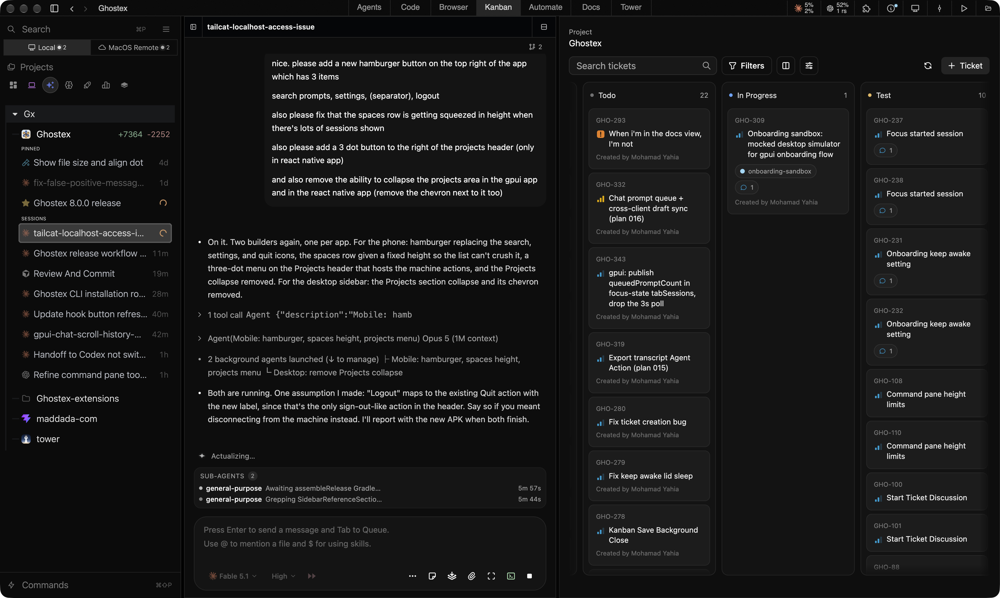

<p align="center">
  
</p>

<p align="center">
  <a href="https://github.com/maddada/Ghostex/releases"></a>
  <a href="https://discord.gg/df7b3G92CS"></a>
  <a href="https://ghostex.dev"></a>
</p>

# Ghostex

Cross-platform Ghostty-based desktop app (not using Electron or Tauri) for running agent CLIs with persistent terminals, GUI panes, browser panes, notifications, mobile access, and a built-in IDE.

Ghostex is built for developers who keep multiple agents and terminals alive at once. It combines low-RAM Ghostty terminals, a native Rust/GPUI interface, Chromium CEF browser panes, and Mobile (iOS/Android) session access in one workspace.

> Looking for contributors. Join the Discord if you want to help: https://discord.gg/df7b3G92CS

## Install

### macOS

The Homebrew cask installs the Apple Silicon build automatically.

```bash
brew trust maddada/tap && brew install --cask maddada/tap/ghostex
```

Latest download: [macOS Apple Silicon DMG](https://maddada.com/download/macos-arm64).

### Windows (WSL2 beta)

> **The Windows app is a beta intended for WSL2 workflows only and may still have bugs.** Install and use it with an existing WSL2 distribution; native Windows shell workflows are not the intended setup yet. Please report problems on the [Ghostex Discord](https://discord.gg/df7b3G92CS).

Latest downloads: [Windows x64](https://maddada.com/download/windows-x64) · [Windows ARM64](https://maddada.com/download/windows-arm64). Ghostex manages its terminals, gxserver, and Source editor inside the selected WSL2 distribution.

Starting with 7.0.0, Windows installations receive automatic updates from GitHub Releases. If you installed a 6.x Windows beta, install the 7.0.0 Setup EXE once to move to the new updater; later releases can be downloaded and applied from inside Ghostex.

### Linux

Latest downloads: [Linux DEB](https://maddada.com/download/linux-deb-x64) · [Linux RPM](https://maddada.com/download/linux-rpm-x64) · [Linux tarball](https://maddada.com/download/linux-tar-x64).

#### Arch Linux and other distributions

The portable `ghostex-<version>-linux-x64.tar.zst` on the
[latest release](https://github.com/maddada/Ghostex/releases/latest) works on any x64
distribution that ships the Chromium runtime libraries. It is a prefix-preserving tree, so
extract it at the filesystem root — that installs `/opt/ghostex` and puts `ghostex` and `gx`
on your `PATH`:

```sh
sudo tar -xpf ghostex-*-linux-x64.tar.zst -C /
ghostex
```

On Arch the runtime dependencies are `gtk3`, `nss`, `nspr`, `mesa`, `libxkbcommon`,
`alsa-lib`, `at-spi2-core`, `libcups`, `libdrm`, `libxcomposite`, `libxdamage`,
`libxrandr`, `libxshmfence`, `pango`, `cairo`, `fontconfig` and `wmctrl` — most are already
present on a desktop install. Ghostex does not bundle Chromium; the first GUI launch
downloads the browser runtime into your cache directory.

A vendor-maintained `ghostex-bin` AUR package is prepared and will be published once
[AUR registration](https://aur.archlinux.org/register) reopens.

### Android

Use the Android app to connect live to your Ghostex agent CLI sessions. APKs are in GitHub Releases.

#### Click the button to get the app:

[](https://github.com/maddada/Ghostex/releases/latest/download/ghostex-android.apk)

### iOS

The testflight for this app is running through our Discord: https://discord.gg/df7b3G92CS
Please join and post in the iOS channel to get the app.

## Gallery

### Built-in IDE

Loads on demand for working with markdown, reviewing code, and checking PRs. <br/>
Supports all extensions. Sleeps when not in use to same resources (configurable).


### Inbox Based Agent Management

This optional inbox moves work beyond individual sessions. <br/>
Organize around threads and worktrees, focus on one project or see every project together, then snooze or settle threads as needed.


### Split your terminals and use keyboard hotkeys to jump between them in the Agents view

The same configurable hotkey flow you're used to from terminals like Ghostty and cmux. <br />
Use Cmd/Ctrl + T for a new terminal, Cmd/Ctrl + D to split, and configurable shortcuts to move between panes.


### Supports all of the popular Agent CLIs

Ghostex works with Claude Code, Codex CLI, OpenCode, Pi Agent, Gemini, and all other Agent CLIs. <br/>

### Embedded Chromium Browser

Comes with Annotations, Chrome Devtools MCP for Agents, Profiles.<br />
/ghostex-embedded-browser-use lets the agent control your embedded browser tabs.


### Rich Prompt Editor with Ctrl+G

Edit your agent prompts with full hotkeys support and image previews! <br />
No more uneditable "[Pasted 50+ lines]" text! Press F1 for all commands.


### Kanban board based on beads!

Put all your thoughts here then let an orchestrator agent manage subagents to tackle them<br/>
(Ghostex supports cross Agent CLI orchestration, your Claude Code can launch and steer Codex agents!)


### Docs view for working with HTML/MD/Excalidraw!

#### Collaborate with your agent on HTML prototypes, mockups, and explainers! Annotations system included!


#### Full markdown editor + annotations that you can send to your agent to collaborate!


#### Or even ask the Agent to draw an .excalidraw UI or diagram in the /docs folder:


### Search Previous Sessions from All Agent CLIs in 1 place

Fuzzy search in all your previous sessions accross agents by typing a few words from your prompts
Press enter to resume that session! Lots of filters available. Start it from the sidebar or run `ghostex find / gx f` to start it


Also see list of all previous sessions from all agents by title/tag/last active so you can resume any of them


### Extensible Architecture (client apps <-> gxserver daemon <-> zmx persistence)

The client/server split allows your to install just the gxserver daemon on any remote machine then control the agents on that machine from any client device <br />

Supported clients: macOS, Linux, Windows WSL2 beta, Android, TUI (based on herdr)<br />
Supported hosts: macOS and linux (tested on ubuntu x64 and arm64)<br />


### Cross-agent orchestration built in

Agents can launch other agent session using the "ghostex" cli command.
You can ask Claude Code to launch Codex sub-agents and send prompts there/read their output.
Write your own skills that use the /ghostex-cli skill.


### Notifications and status

Ghostex supports notification sounds, menu bar indicators (running/done agents), and phone app notifications.<br/>
See how many agents are running with just a glance at your menu bar. Click to jump to an agent!


## Highlights

| Feature              | What it gives you                                                  |
| -------------------- | ------------------------------------------------------------------ |
| Ghostty terminals    | Lower RAM use, better battery life, and stable agent CLI sessions. |
| Native desktop shell | Rust/GPUI UI for performance-sensitive desktop behavior.           |
| Chromium CEF browser | Embedded browser panes with DevTools, profiles, and MCP access.    |
| Built-in IDE         | VS Code-based editor for Markdown, PR review, files, and git work. |
| Mobile access        | iOS & Android app for checking and controlling live sessions.      |
| TUI mode             | Use `ghostex` or `gx` to attach from another machine.              |

## Comparison

| Feature                   | Ghostex | Codex app | cmux |
| ------------------------- | ------- | --------- | ---- |
| macOS support             | Yes     | Yes       | Yes  |
| Windows support           | Yes     | Yes       | No   |
| Linux support             | Yes     | No        | No   |
| Open source               | Yes     | -         | Yes  |
| Ghostty terminal          | Yes     | -         | Yes  |
| Chromium Browser          | Yes     | Yes       | No   |
| Fully featured IDE        | Yes     | -         | -    |
| Built-in Computer use     | Yes     | Yes       | -    |
| Built-in Browser use      | Yes     | Yes       | Yes  |
| Use any model             | Yes     | -         | Yes  |
| Cross Model Orchestration | Yes     | -         | Yes  |
| Rich Prompt Editor        | Yes     | N/A       | -    |
| Android                   | Yes     | Yes       | -    |
| Appshots                  | Yes     | Yes       | -    |
| Automations               | Yes     | Yes       | -    |

## Main Features

- Git workflows with Sync with Main, split Git menus, prompt-agent PR review, and persistent running toasts.
- First-prompt title generation for auto-naming new agent sessions.
- Pinned sessions and assigning tags to sessions.
- Auto-sleep for unused terminal, browser, and project panes.
- Live Android access to agent CLI sessions.
- All sessions are persistant and attachable by default (uses zmx).
- Rich prompt editor with image insert and preview support.
- Auto session naming for popular agents.
- App restart resumes existing agent CLI sessions.
- Menu bar working/done indicators and notification sounds for most agent CLIs.
- Multi-pane and multi-group project layouts.
- Scheduled messages and automation through the Ghostex CLI.
- Install gxserver daemon on remote. Connect over SSH in settings. Remote machines show in sidebar.
- Create worktrees and merge them back easily.
- Find previous threads by keyword and continue with context.
- Sync session titles and status into the UI.
- Run multiple panes and multiple groups per project with split and tab layouts.

## Contributing

Ghostex is moving quickly, and help is welcome on platform ports, missing agent CLI integrations, docs, testing, and feature polish.

Join the Discord: https://discord.gg/df7b3G92CS

## Credits

Ghostex builds on open source work from these projects and communities:

- [CEF Project](https://github.com/chromiumembedded/cef) — embedded Chromium browser panes
- [Agentation](https://github.com/benjitaylor/agentation) — browser annotation and feedback tooling
- [CMUX](https://github.com/manaflow-ai/cmux) — agent hook patterns and notification integration
- [VS Code](https://github.com/microsoft/vscode) and [code-server](https://github.com/coder/code-server) — embedded IDE surfaces
- [zehn](https://github.com/al3rez/zehn) by [al3erz](https://github.com/al3rez) — searching sessions by prompt
- [vvterm](https://github.com/vivy-company/vvterm) — source of terminal ideas ported into the mobile app
- [Termux](https://github.com/termux/termux-app) — Android terminal components ported into the mobile app
- [Pierre Computer Company](https://github.com/pierrecomputer/pierre) — diffs and file rendering components
- [Beads](https://github.com/steveyegge/beads) by [Steve Yegge](https://github.com/steveyegge) — kanban project board
- [Beads Viewer](https://github.com/Dicklesworthstone/beads_viewer) by [doodlestein](https://github.com/Dicklesworthstone) — kanban view reference
